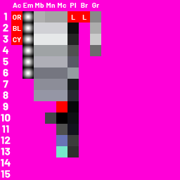

# Rendering

[Half destroyer](downloads/HalfDestroyer.blend) blender file from the official game (for reference)

Here is the meaning of the texture atlas

- Accent
- Emissive
- Metal brushed
- Metal noise
- Metal coating
- Plastic
- Belt Rubber
- Greeble

[simple uv editing tutorial](https://youtu.be/JP3orYaq_Co)

Useful uv editing keybinds

- move : g
- rotate : r
- scale : s
- rip and move : v
