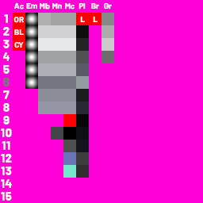

# Resources provided by the shapez 2 team

## Blender art files

- <a href="/assets/Converter_Rocketship.blend" download>Converter rocket</a>
- <a href="/assets/Space_TrainLoader.blend" download>Train loader</a>
- <a href="/assets/SpacePipes.blend" download>Space pipe</a>
- <a href="/assets/HalvesSwapper.blend" download>Swapper</a>
- <a href="/assets/Rotator.blend" download>Rotator</a>
- <a href="/assets/Stacker.blend" download>Stacker</a>
- <a href="/assets/Wires_LogicGates.blend" download>Logic gates</a>

## Materials

- <a href="/assets/MaterialLUT.psd" download>Material table</a>
- <a href="/assets/MaterialLUTPreview.png" download>Material table ingame</a>

